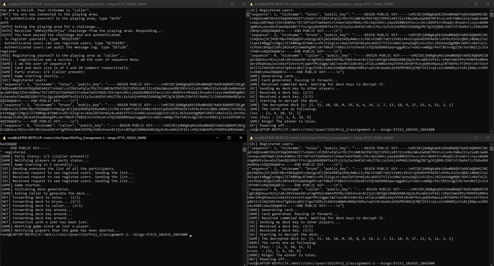

# Secure_Bingo
## _Assigment 2_

Project Documentation

## Files
*
    | | |
    |---|----|
    | File | Description |
    | Caller.py | Script for initializing the Caller process (requires nickname) |
    | Player.py | Script for initializing the Player process (requires nickname) |
    | PlayingArea.py | Script for initializing the Playing Area  process (requires card and deck size) |
    | src/user.py | Generic logic for both the caller and player |
    | src/caller.py | Extends user.py and implements Caller specific logic |
    | src/player.py | Extends user.py and implements Player specific logic |
    | src/playing_area.py | Playing Area logic |
    | src/protocol.py | Contains the messages classes and functions for sending and receiveing messages through websockets |
    | src/crypto.py | Helper functions for cryptography operations |
    | src/common.py | Data types that are common to multiple classes. Namely player and log data. |
    
    To test the project, run PlayingArea.py, Caller.py and at least two Player.py instances.
    
## Communication Protocol

### Messages

* **Message** 
    | | |
    |---|----|
    | Description | Generic message |
    |Methods| to_json(), should_log() __returns True__|
    

* **Authenticate**
    | | |
    |---|----|
    | Description | Message for Users to authenticate themselves to the playing area. Uses challenge-response authentication |
    |Extends|Message|
    |Methods| parse() |
    |Parameters| <ul><li>public_key</li><li>challenge</li><li>response</li><li>success</li></ul>|

* **Register**

    | | |
    |---|----|
    | Description | Message for players to register themselves to the playing area|
    |Extends|Message|
    |Methods| parse() |
    |Parameters|<ul><li>nickname</li><li>playing_key</li><li>auth_key</li><li>signature</li><li>success</li><li>sequence</li></ul>|

* **GetUsers**

    | | |
    |---|----|
    | Description | Message for getting a list of registered users |
    |Extends|Message|
    |Methods| parse(), should_log() __returns false__|
    |Parameters|<ul><li>public_key</li><li>signature</li><li>response</li></ul>|

* **CardSize**    

    | | |
    |---|----|
    | Description | Simple message for letting users know the card size |
    |Extends|Message|
    |Methods| parse(), should_log() __returns false__|
    |Parameters|<ul><li> card_size</li></ul>|

* **GetLog**

    | | |
    |---|----|
    | Description | Message for getting a list of logged messages |
    |Extends|Message|
    |Methods| parse(), should_log() __returns false__ |
    |Parameters|<ul><li>public_key</li><li>signature</li><li>response</li></ul>|

    should_log -> returns false
* **PartyUpdate**

    | | |
    |---|----|
    | Description | Message for updating registered users on how big the party is |
    |Extends|Message|
    |Methods| parse(), should_log() __returns false__ |
    |Parameters|<ul><li>public_key</li><li>signature</li><li>response</li></ul>|

    should_log -> returns false

* **GenerateDeck**
    | | |
    |---|----|
    | Description | Message telling the caller to generate the deck and initiate the card generation proccess |
    |Extends|Message|
    |Methods| parse()|
    |Parameters|<ul><li>deck_size</li></ul>|

* **GenerateCard**

    | | |
    |---|----|
    | Description | Message Players will pass around until everyone has commited their card |
    |Extends|Message|
    |Methods| parse()   sign(private_key : str) <ul> **Description**: Signs the deck with private_Key and append the public key to the signatures array   Call our Cryptography function __sign__</ul>   verify(publicKey : str, signature) <ul> **Description**: Verifies the signature of the deck with the public key   Call our Cryptography function __verify__</ul>|
    |Parameters|<ul><li>sequence (int)</li><li>deck (list)</li><li>signatures (list)</li><li>done (bool)</li></ul>|

* **DeckKeyRequest**

    | | |
    |---|----|
    | Description | Message requesting that players and caller reveal their symmetric key after the deck is commited|
    |Extends|Message|
    |Methods| parse()|
    |Parameters|<ul><li>sequence</li></ul>|

* **DeckKeyResponse**

    | | |
    |---|----|
    | Description | Response to the deck key request |
    |Extends|Message|
    |Methods| parse()   sign(private_key : str) <ul> **Description**: Signs the response with private_Key and assigns it to signature  Call our Cryptography function __sign__</ul>|
    |Parameters|<ul><li>sequence</li><li>response</li><li>signature</li></ul>|

* **GameOver**

    | | |
    |---|----|
    | Description | Message for when the game is over / aborted  |
    |Extends|Message|
    |Methods| parse()    should_log() __returns false__   __ str __()|
    |Parameters|<ul><li>status</li></ul>|

###  Proto (Class)

* **Methods**

    * send_msg
        | | |
        |---|----|
        | Description | Sends through a connection a Message object. |
        |Parameters|<ul><li> connection: socket</li><li> msg: Message</li></ul>|
        |Return | None |

    * recv_msg

        | | |
        |---|----|
        | Description | Receives through a connection a Message object. |
        |Parameters|<ul><li> connection: socket</li></ul>|
        |Return | Message |
    
    * parse_msg

        | | |
        |---|----|
        | Description | Returns from message string  a Message Instance|
        |Parameters|<ul><li> msg_str: str</li></ul>|
        |Return | Message |

* **ProtoBadFormat** (Class)

    | | |
    |---|----|
    | Description | Exception when source message is not Proto.|
  

## Cryptography Protocol, Crypto (Class)

Cryptographic utilities

Uses **cryptography.hazmat.primitives**

### Methods

* **sym_gen**
    | | |
    |---|----|
    | Description | Generates a new AESGCM (key, nonce) tuple|
    |Parameters||
    |Return | tuple |

* **sym_encrypt**
    | | |
    |---|----|
    | Description | Encrypts data given with given AESGCM key|
    |Parameters|<ul><li> key: bytes</li><li>data</li><li>nonce: bytes</li></ul>|
    |Return | bytes |

* **sym_decrypt**
    | | |
    |---|----|
    | Description | Decrypts encrypted data given with given AESGCM key |
    |Parameters|<ul><li> key: bytes</li><li>crypted_data</li><li>nonce: bytes</li></ul>|
    |Return | bytes |

* **do_hash**

    | | |
    |---|----|
    | Description | Returns an hash of a given data; Uses SHA256|
    |Parameters|data: bytes|
    |Return | bytes |

* **asym_gen**

    | | |
    |---|----|
    | Description | Encrypts data using given public key|
    |Parameters||
    |Return | bytes |

* **sign**

    | | |
    |---|----|
    | Description | Returns Signature of given data signed with given private key; Uses SHA256|
    |Parameters|<ul><li> private_key</li><li>data</ul>|
    |Return | bytes |

* **verify**

    | | |
    |---|----|
    | Description | Verifies if given message matches with given signature; Uses SHA256|
    |Parameters|<ul><li> public_key</li><li>message</li> <li>signature: bytes</li></ul>|
    |Return | bool |

# Project Running Example

